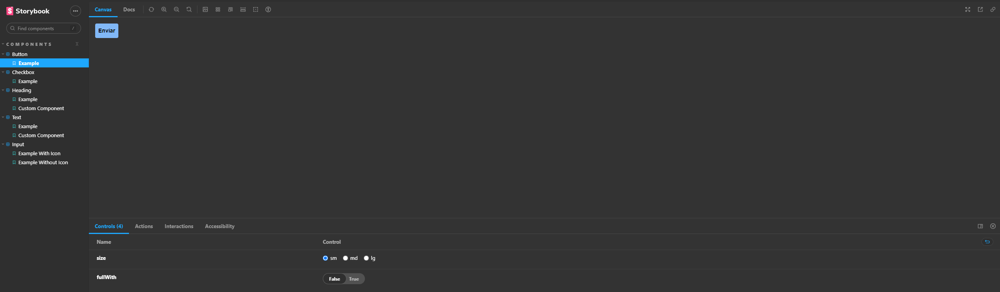

## Getting Started

When cloning the repository, run one of the commands:

```bash
npm install
# or
yarn install
```

To start the server:

```bash
npm run dev
# or
yarn dev
```

## You can access the application through the link

[Access application](https://israelitalo.github.io/design-system-storybook)

